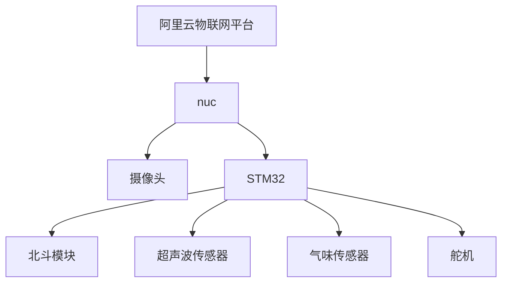
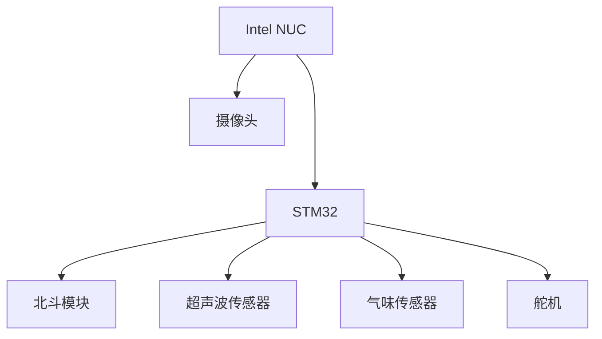
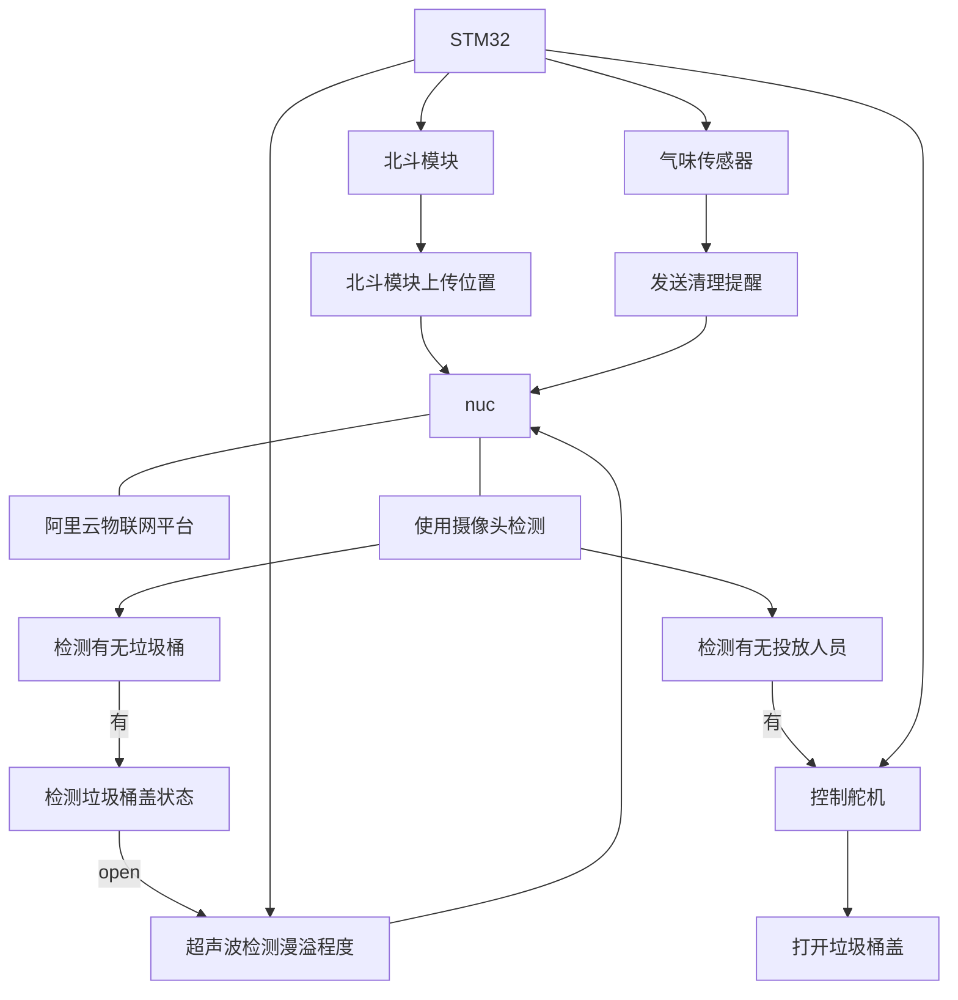

# Smart_Garbage_Room_Management_System

项目名称: 智回收-智能校园垃圾房管理系统

智能校园垃圾房管理系统是一种利用物联网、人工智能、大数据等技术，对校园内的垃圾分类、收集等过程，进行监控和优化的系统。它可以提高垃圾分类的效率和质量，减少环境污染和资源浪费，提升校园形象。

## 主要功能

1.定位垃圾桶位置
2.垃圾桶异味检测
3.垃圾桶容量检测
4.通讯装置

## 需要解决的问题

1.加装摄像头装置（加装5G通讯），用于检测垃圾桶是否盖上盖子
2.是否有人来扔垃圾（有人来扔垃圾时打开垃圾桶盖）
3.垃圾桶盖上盖子时超声波测距装置开始工作检测垃圾桶容量
4.都接入互联网，在阿里云物联网平台上，实现数据可视化
5.北斗 用于定位垃圾桶的位置

## 系统结构

系统结构示意图

系统结构示意图_V2

各个模块间的交互与通信示意图

## How to use

1. Clone the repository via `git clone https://github.com/xxx.git` and cd into the cloned repository.
2. Install the required packages: `pip install -r requirements.txt`
3. 编辑 `config.json`
4. 使用命令行运行 `python3 main.py`
5. 打开 [阿里云物联网平台](https://www.aliyun.com) 查看运行状态
